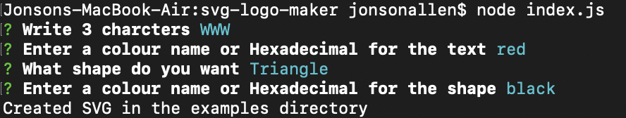
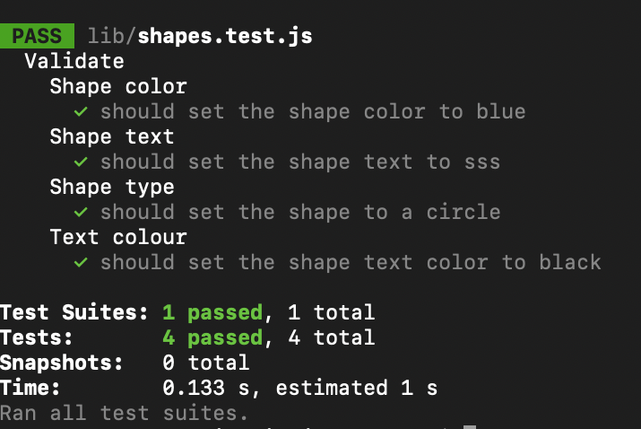

# svg-logo-maker

## Decription 
The SVG logo maker is a command line application that takes in user input from a series of question to create a simple logo. The prompts as what test you want for your logo, the colour of the background and as well as the colour for your text. My motivation for this project was so I can create as simple logo easily without having to look for help from anyone. Throughout this project I learned how to utlize classes in Javascript as well as utlizing exporting and require to work throughout multiple documents. I also learned how to utilize "jest"[#dependencies] to create tests for my code. I found creating SVG logos difficult, also wriitng tests did not come easy to me. Looking through the documentation helped out a lot. 

## Future Development 
The future development of this project would be to firstly create a better looking and formatted shape. I then plan on having more shapes and the option for more text in the logos created. 

## Installation
1. Git clone the repository using the following command: git clone git@github.com:StunnaDawg/svg-logo-maker.git
2. Through the CLI cd into the svg-logo-maker directory
3. If you do not have nodejs installed follow the link to download it: https://nodejs.org/en
4. Ensure to 'npm install' all the dependencies
5. Run 'node index.js' while in the svg-logo-maker directory to initate the prompts
6. Answer all the prompts
7. Once finished the logo.svg will be located in the examples folder within the directory

## Usage
Upon downloading the application make sure you do the following:

1. run 'npm install' so that the dependcies are installed
2. If the dependencies do not exist: run 'npm i inquirer' to download the latest version of inquirer and 'npm i jest' to run test
3. run 'node index.js' to recieve the question prompts'

## Screenshot

## Demo
Demo video link: https://watch.screencastify.com/v/OozwUt42Ln0QtsuXzcEa

## Dependencies

- nodeJS: https://nodejs.org/en
- inquirer: https://www.npmjs.com/package/inquirer
- jest: https://www.npmjs.com/package/inquirer

## Tests

Using the dependency "jest"[#dependencies] I wrote a few tests to test the functionality of my application. Simple cd into the ./lib folder and run npm test to test the application. Before running test make sure to npm install so all the dependencies are ready to go.

